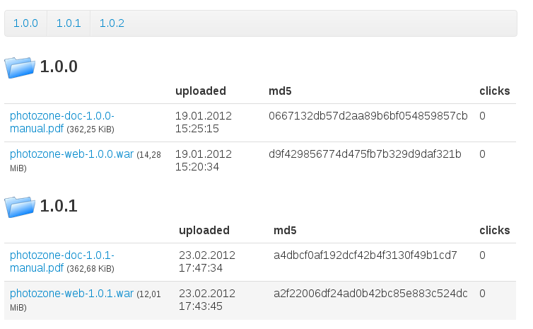

# The `ext` module

This module contains some nice-to-have extensions.

## Contact form

TODO

## Download Template

This is a predefined template that renders a download component. The component
is a table and each row represents a file. The click count and md5 checksum are
also rendered.

Include it in your `jade` page like this:

    - setAttribute("rootDir", Some("/some/other/path/"))
    =include("/publet/ext/includes/templates/_downloadTable.jade")

Here is an example screen:

You can control the resulting output by specifying following optional paramters:

* `rootDir`: (String) the path to a directory. all files within that directory are rendered for download. It
  defaults to the directory of the current page.
* `folderImagePath`: (String) an internal path to a image resource that is used to display next to folders
* `exclExtensions`: (Seq[String]) a set of file extensions. Those files are _excluded_ from rendering. The
   default list is `Seq("html", "jade", "md", "markdown", "page", "ssp")`.

By default, the template displays all files in the specified root directory and all files
located in all sub directories (not recursive, only one level). At the top a simple link list
is rendered that takes you to the named sub folder.

The image above was rendered with a root directory with the following structure

    .
    |-- 1.0.0
    |   |-- photozone-doc-1.0.0-manual.pdf
    |   `-- photozone-web-1.0.0.war
    |-- 1.0.1
    |   |-- photozone-doc-1.0.1-manual.pdf
    |   `-- photozone-web-1.0.1.war
    `-- 1.0.2
        |-- photozone-doc-1.0.2-manual.pdf
        `-- photozone-web-1.0.2.war

## Change Password and "my data" template

There exists a template that can be included that displays two forms: one for
changing the password and one that lets the current user change his name and
email.

This is only valid for authenticated users.

Include it in your `jade` template like this:

    =include("/publet/ext/includes/templates/_myData.jade")

By default, both forms are displayed horizontally using bootstraps `div`
classes (using class `span4` for both forms). By setting a parameter, you
can get the forms layout vertically:

    - setAttribute("layoutHorizontal", Some(false))
    =include("/publet/ext/includes/templates/_myData.jade")

Other parameters are

* `formAction`: (String) the url to the update script (optional)
* `renderResponseElement`: (Boolean) whether to render the div element that is used
  to render json responses. If this parameter is set to `false`, the div is not rendered.
  This way you can add a div element with id `myDataResponse` to the page manually (where
  you want to have it). (optional, defaults to `true`)
* `hashAlgorithm`: (String) the hash algorithm to be used when changing the password.
  (optional, defaults to _SHA-512_)
