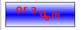
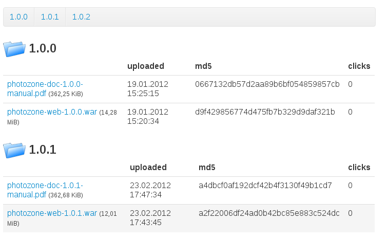

## Contact form

The contact form is a predefined template and a scala script. The template
renders a simple contact form whose values are submitted to the scala script.
The script is sending the contents via mail to a configured email address.

The template can be included in your page, for example in a `jade` page:

    =include("/publet/ext/includes/templates/_contactForm.jade")

You need to specify SMTP settings in the configuration file `publet.properties`
for the contact form to work. The following two must be provided

    defaultReceiver=receiver@email.com
    smtp.host=my.smtp.host.com

The `defaultReceiver` is the recipient of the contact form contents. Then there
are three other properties that have default values, if not provided

    smtp.port=25
    smtp.username=
    smtp.password=

If `username` is emtpy, no authentication is performed on the SMTP server.

You can also easily create your own template and reuse the scala script. Just
make sure that you use the same fields as in the provided template. The script
and template are very simple, and can be used as a starting point to create
custom email features. The script is the file `org.eknet.publet.ext.MailContact`
and the template is named above.

## Captcha

The script `org.eknet.publet.ext.CaptchaScript` generates a png showing a random
string. The same string is set into the current session and can be used by other
scripts to compare form input against it.

You can see the captcha at this URL

    /publet/ext/scripts/captcha.png

This would create something like this:

The colors can be changed via url parameters, as the string used for binding the
generated captcha string into the session:

* `col1` / `col2` define the two colors for the background gradient. Default is `ffffff` and `0000ff`.
* `frcol` defines the frame color. Default is `000000`.
* `fgcol` defines the fore ground color. Default is `ff0f00`.
* `captchaParam` the string used to bind the captcha string into the session. Default is `captchaString`

For example, the URL

    /publet/ext/scripts/captcha.png?col1=000000&col2=000000&frcol=ffffff&fgcol=ffffff

would create this captcha image:

When using the captcha in a form, include the image using an URL like above and provide
a text input field where the user enters the image string. In the script that receives
the form, the captcha string can be compared against the one in the session which is
retrieved via

    import org.eknet.publet.web.util.Key
    val captchaString: String = PubletWebContext.attr(Key[String]("captchaString")).get

Another example is this simple `jade` template, which shows the captcha in action:

    h1 Captcha Test
    p Here is the captcha:
    img(src={PubletWebContext.urlOf("/publet/ext/scripts/captcha.png")})
    - import org.eknet.publet.web.util.Key
    p and here the string obtained from the session:
    blockquote
      =PubletWebContext.attr(Key[String]("captchaString")).getOrElse("!!nothing!!")

## Download Template

This is a predefined template that renders a download component. The component
is a table and each row represents a file. The click count and md5 checksum
are also rendered. (Note, the click-count is only available, if the
`CounterExtension` is active).

Include it in your `jade` page like this:

    - setAttribute("rootDir", Some("/some/other/path/"))
    =include("/publet/ext/includes/templates/_downloadTable.jade")

Here is an example screen:

You can control the resulting output by specifying following optional paramters:

* `rootDir`: (String) the path to a directory. all files within that directory
  are rendered for download. It defaults to the directory of the current page.
* `folderImagePath`: (String) an internal path to a image resource that is
  used to display next to folders
* `exclExtensions`: (Seq[String]) a set of file extensions. Those files are
  _excluded_ from rendering. The default list is `Seq("html", "jade", "md", "markdown", "page", "ssp")`.

By default, the template displays all files in the specified root directory
and all files located in all sub directories (not recursive, only one level).
At the top a simple link list is rendered that takes you to the named sub
folder.

The image above was rendered with a root directory with the following
structure

    .
    |-- 1.0.0
    |   |-- photozone-doc-1.0.0-manual.pdf
    |   `-- photozone-web-1.0.0.war
    |-- 1.0.1
    |   |-- photozone-doc-1.0.1-manual.pdf
    |   `-- photozone-web-1.0.1.war
    `-- 1.0.2
        |-- photozone-doc-1.0.2-manual.pdf
        `-- photozone-web-1.0.2.war

## _Change Password_ and _My Data_ template

There exists a template that can be included that displays two forms: one for
changing the password and one that lets the current user change his name and
email.

This is only valid for authenticated users.

Include it in your `jade` template like this:

    =include("/publet/ext/includes/templates/_myData.jade")

By default, both forms are displayed horizontally using bootstraps `div`
classes (using class `span4` for both forms). By setting a parameter, you can
get the forms layout vertically:

    - setAttribute("layoutHorizontal", Some(false))
    =include("/publet/ext/includes/templates/_myData.jade")

Other parameters are

* `formAction`: (String) the url to the update script (optional)
* `renderResponseElement`: (Boolean) whether to render the div element that is used
  to render json responses. If this parameter is set to `false`, the div is not rendered.
  This way you can add a div element with id `myDataResponse` to the page manually (where
  you want to have it). (optional, defaults to `true`)
* `hashAlgorithm`: (String) the hash algorithm to be used when changing the password.
  (optional, defaults to _SHA-512_)

## Counter Extension

The counter extension is tracking some data for each request, namely the
number of visits of an URL and the last time it was accessed.

To avoid counting requests too often, the IP address is cached in memory (not
on disk!) for a specific amount of time (default is 2h). If the same IP hits
the same URL within this time frame, it is not counted. The data is saved
inside a graph database on the server.

The data is available via the `CounterService`. Retrieve it via
`CounterExtension.service`.

You can specify a list of ip addresses in `settings.properties` that should
be discarded from counting (maybe you don't want to count your own accesses).

The key must start with `ext.counter.blacklist.` and appended with an ip address
or a valid hostname. A value of `true` will black-list the ip, a value of `false`
yields in counting accesses from this ip. If a hostname is given, it is resolved
on application start to its ip address.

#### Examples:

    ext.counter.blacklist.110.110.110.110=true
    ext.counter.blacklist.127.0.0.1=true

By default, accesses from all ips are taken into account but not user agents
with words _bot_ or _spider_ in their name.

Additionally a glob pattern can be specified that is matched against the uri. Only
if it matches, the uri is counted. If no such pattern is found, this evaluates to
`true`. Specify the pattern in `settings.xml` with key `ext.counter.pattern`:

    ext.counter.pattern=/main/**

This would count only URLs starting with `/main/`, all others are discarded. The glob
can contain a `*` to match any sequence of characters but not a `/`, a `?` to match any
single character and `**` to match any sequence of characters including `/`.

## Blueprints / OrientDB

The `ext` module is introducing a database to publet. It uses the
graph/document database [OrientDB](http://code.google.com/p/orient/) while
code should be written against the
[Blueprints](http://blueprints.tinkerpop.com/) API that is part of the
[Tinkerpop stack](http://tinkerpop.com/).
[Blueprints](http://blueprints.tinkerpop.com/) provides an API, that makes
your code independent from the underlying graph database.

### API

The object `OrientDb` can be used to create new databases:

    /**
     * Creates a new [[com.tinkerpop.blueprints.impls.orient.OrientGraph]] instance.
     *
     * @param name
     * @return
     */
    def newGraph(name: String): OrientGraph

    /**
     * Creates a new [[org.eknet.publet.ext.orient.OrientDb]] with a new
     * instance of a [[com.tinkerpop.blueprints.impls.orient.OrientGraph]].
     *
     * @param name
     * @return
     */
    def newDatabase(name: String): OrientDb

Databases can only be created once on application startup. A listener is
registered that will shutdown all Orient databases on application exit.

For the counter extension and for convenience, there is a database created. You
can access it by using the `org.eknet.publet.ext.ExtDb` singleton.