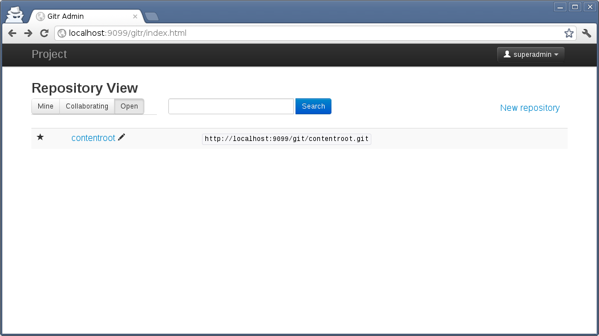
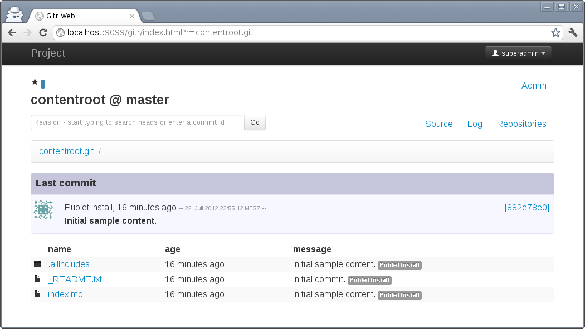

# The _gitr-web_ module

This extension provides a git repository manager for publet. Since the content
root is also a git repository, this module provides a means to browse the
complete history of the web page content.

It is strongly inspired by [github](https://github.com),
[gitweb](https://git.wiki.kernel.org/index.php/Gitweb) and
[gitblit](http://gitblit.com/). It has the following features:

* create new git repositories: you can create repositories that are either
  "root repositories" or located below a username. For example, a root
  repository is available at path `/git/repo.git`, while normally you'd create
  a repository under your login `/git/<login>/repo.git`.
* supports open and closed repositories. Open repository can be cloned by
  anyone. There is no need to authenticate.
* add/remove collaborators. Grant other users _pull_ or _push_ rights to your
  repository
* repository web view:
    * browse repository contents
    * commit history (git log)
    * commit diff details

## Usage

The module can be accessed at path `/gitr/index.html`.

The screen shot shows the listing of all git repositories. Since this is right
after a fresh install, only the content root repository is shown. If the
current user has appropriate permissions, the link "New repository" is shown.
If the current user has `push` permission to a repository, a pencil icon is
next to the repository name. The right column shows the URL which can be used
to clone the repository.

All repositories are available under the `/git/` path. Thus, if publet is at
`http://mydomain.com` a repository of name "publet.git" can be cloned at
`http://mydomain.com/git/publet.git`. The gitr-web module is usually mounted
at `/gitr` path (note the additional _r_!). The URL to the web view of an
repository is created by specifying an URL parameter of name `r`. For example,
the Url `http://mydomain.com/gitr/?r=publet.git` would point to the web view
of the repository `publet.git`. The following screenshot shows the view of
a repository.

## Open/Closed repositories and owners

Each repository can have an owner and it can be an open or closed repository.
The owner is identified via its login name. The owner automatically has all
permissions regarding the repository.

You can specify an owner in `permissions.xml`:

    <repositories>
      <repository name="contentroot" tag="closed" owner="jdoe"/>
    </repositories>

The snippet above specifies the content root repository to be closed, thus
each (read) access to it is restricted to users with `pull:contentroot`
permission. Then it specifies the user _jdoe_ to be the owner of the
repository.

## Permissions

There are two access permissions referring a repository by name (without the
`.git` extension):

* `push:<repositoryname>` write access (allows `git push`) for the specified
  repository
* `pull:<repositoryname>` read access (allows `git pull`, `git clone`) for the
  specified repository

You need to grant those permissions in `permissions.xml`:

    <grant name="push">
      <on>contentroot</on>
      <to>admin</to>
    </grant>

The snippet above grants the `push` permission for the content root repository
to the `admin` group.

Furthermore there exists three permissions for repository administration:

* `gitcreate` allows to create personal repositories (they are located under
  the user's login name).
* `gitcreateRoot` allows to create root repositories
* `gitadmin` allows to administrate a repository. This includes deletion. The
  owner has implicitely the `gitadmin` permission for his repository.

Administration involves the following functions:

* change state (open, closed)
* add/remove collaborators
* delete the repository
* transfer ownership

Collaborators are other registered users that have some explicit pull or push
permission on a foreign repository.
