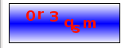
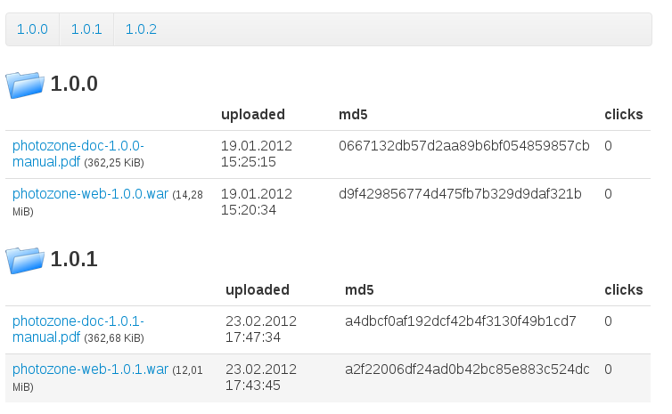

## Contact form

The contact form is a predefined template and a scala script. The template
renders a simple contact form whose values are submitted to the scala script.
The script is sending the contents via mail to a configured email address.

The template can be included in your page, for example in a `jade` page:

    =include("/publet/ext/includes/templates/_contactForm.jade")

You need to specify SMTP settings in the configuration file `publet.properties`
for the contact form to work. The following two must be provided

    defaultReceiver=receiver@email.com
    smtp.host=my.smtp.host.com

The `defaultReceiver` is the recipient of the contact form contents. Then there
are three other properties that have default values, if not provided

    smtp.port=25
    smtp.username=
    smtp.password=

If `username` is emtpy, no authentication is performed on the SMTP server.

You can also easily create your own template and reuse the scala script. Just
make sure that you use the same fields as in the provided template. The script
and template are very simple, and can be used as a starting point to create
custom email features. The script is the file `org.eknet.publet.ext.MailContact`
and the template is named above.

## Captcha

The script `org.eknet.publet.ext.CaptchaScript` generates a png showing a random
string. The same string is set into the current session and can be used by other
scripts to compare form input against it.

You can see the captcha at this URL

    /publet/ext/scripts/captcha.png

This would create something like this:

The colors can be changed via url parameters, as the string used for binding the
generated captcha string into the session:

* `col1` / `col2` define the two colors for the background gradient. Default is `ffffff` and `0000ff`.
* `frcol` defines the frame color. Default is `000000`.
* `fgcol` defines the fore ground color. Default is `ff0f00`.
* `captchaParam` the string used to bind the captcha string into the session. Default is `captchaString`

For example, the URL

    /publet/ext/scripts/captcha.png?col1=000000&col2=000000&frcol=ffffff&fgcol=ffffff

would create this captcha image:

When using the captcha in a form, include the image using an URL like above and provide
a text input field where the user enters the image string. In the script that receives
the form, the captcha string can be compared against the one in the session which is
retrieved via

    import org.eknet.publet.web.util.Key
    val captchaString: String = PubletWebContext.attr(Key[String]("captchaString")).get

Another example is this simple `jade` template, which shows the captcha in action:

    h1 Captcha Test
    p Here is the captcha:
    img(src={PubletWebContext.urlOf("/publet/ext/scripts/captcha.png")})
    - import org.eknet.publet.web.util.Key
    p and here the string obtained from the session:
    blockquote
      =PubletWebContext.attr(Key[String]("captchaString")).getOrElse("!!nothing!!")

## Download Template

This is a predefined template that renders a download component. The component
is a table and each row represents a file. The click count and md5 checksum
are also rendered. (Note, the click-count is only available, if the
`CounterExtension` is active).

Include it in your `jade` page like this:

    - setAttribute("rootDir", Some("/some/other/path/"))
    =include("/publet/ext/includes/templates/_downloadTable.jade")

Here is an example screen:

You can control the resulting output by specifying following optional paramters:

* `rootDir`: (String) the path to a directory. all files within that directory
  are rendered for download. It defaults to the directory of the current page.
* `folderImagePath`: (String) an internal path to a image resource that is
  used to display next to folders
* `exclExtensions`: (Seq[String]) a set of file extensions. Those files are
  _excluded_ from rendering. The default list is `Seq("html", "jade", "md", "markdown", "page", "ssp")`.

By default, the template displays all files in the specified root directory
and all files located in all sub directories (not recursive, only one level).
At the top a simple link list is rendered that takes you to the named sub
folder.

The image above was rendered with a root directory with the following
structure

    .
    |-- 1.0.0
    |   |-- photozone-doc-1.0.0-manual.pdf
    |   `-- photozone-web-1.0.0.war
    |-- 1.0.1
    |   |-- photozone-doc-1.0.1-manual.pdf
    |   `-- photozone-web-1.0.1.war
    `-- 1.0.2
        |-- photozone-doc-1.0.2-manual.pdf
        `-- photozone-web-1.0.2.war

## _Change Password_ and _My Data_ template

There exists a template that can be included that displays two forms: one for
changing the password and one that lets the current user change his name and
email.

This is only valid for authenticated users.

Include it in your `jade` template like this:

    =include("/publet/ext/includes/templates/_myData.jade")

By default, both forms are displayed horizontally using bootstraps `div`
classes (using class `span4` for both forms). By setting a parameter, you can
get the forms layout vertically:

    - setAttribute("layoutHorizontal", Some(false))
    =include("/publet/ext/includes/templates/_myData.jade")

Other parameters are

* `formAction`: (String) the url to the update script (optional)
* `renderResponseElement`: (Boolean) whether to render the div element that is used
  to render json responses. If this parameter is set to `false`, the div is not rendered.
  This way you can add a div element with id `myDataResponse` to the page manually (where
  you want to have it). (optional, defaults to `true`)
* `hashAlgorithm`: (String) the hash algorithm to be used when changing the password.
  (optional, defaults to _SHA-512_)

## Thumbnails

The `org.eknet.publet.ext.thumb.ThumbnailExtension` adds a convenient thumbnail feature. First, it
provides `Thumbnailer` service, that can be used in code to create a thumbnail of some image resource.
It will cache the thumbnail in a temporary directory.

A script mounted at `/publet/ext/thumbnail/thumb.png` looks for three URL parameters:

* `resource`: the path to a image resource for which a thumnail is requested (mandatory)
* `maxh`: the maximum height of the thumbnail (optional)
* `maxw`: the maximum width of the thumbnail (optional)

If `maxw` and `maxh` are not specified, some default value is used. If no such URL parameters
are present, the script will search the request and session for the following attributes:

* `thumbnail.maxHeight` of type `Int`
* `thumbnail.maxWidth` of type `Int`
* `thumbnail.imageResource` of type `ContentResource` (which is prefered) or `thumbnail.resourcePath` of type `String`

The thumbnail is only created, if the image is bigger than the requested size.

### Intercepting Image URLs

The extension will intercept URLs to an image resource if the URL parameter `thumb` is present. In
this case the image resource is looked up and put into the request atttribute map using the
`thumbnail.imageResource` key and the request is forwarded to the thumbnail script. Thus, a thumbnail
can be requested by just appending `?thumb` to the URL of any image. Optionally append `maxh` or `maxw`
with a corresponding value to configure the thumbnail size.

#### Examples

 * `http://my.server.com/main/images/dogs.png` -> the plain image in original size
 * `http://my.server.com/main/images/dogs.png?thumb` -> a thumbnail image of the default configured size
 * `http://my.server.com/main/images/dogs.png?thumb&maxh=400&maxw=600` -> a thumbnail image with at most
   600 pixel width and at most 400 pixel height

### Configuration

The thumbnails are saved to a directory on the server. The maximum entries or the maximum used disk space
can be configured in the `publet.properties` configuration file. For example:

    thumbnail.maxEntries=1000
    thumbnail.maxDiskSize=20MiB

The disk size can be specified as a plain number, in which case the unit `Byte` is assumed. Otherwise, one
of the following units can be used: `Bytes`, `KiB`, `MiB`, and `GiB`.

Only one of the two constraints can be specified! If both are given (as in the example), the `maxDiskSize`
value is prefered. If nothing is specified, a default value of `50MiB` is used.

## JMX Connector

For accessing mbeans, there is a connector started that exposes the platforms mbean server. It is only started,
if a `publet.jmx.serviceUrl` configuration value is defined. This url is used to bind the service to. For example:

    publet.jmx.serviceUrl=service:jmx:jmxmp://localhost:9012

Note, to use the `jmxmp` protocol, you must download the `jmxremote_optional.jar` from [Oracle](http://www.oracle.com/technetwork/java/javase/tech/download-jsp-141676.html)
(search for _Java Management Extensions (JMX) Remote API Reference Implementation_) and add it somehow to the
classpath. You can drop it in the `plugins` directory or add it as an extension to your java installation -- put
the jar in `$JRE/lib/ext` directory. This way it is globally available. Of course, all clients need this jar, too.
This jar cannot be bundled with publet, because its license is not compatible with publets license.

The connector is not protected by default. It can be protected by specifying `publet.jmx.protected=true` in
the config file. Then only users with permission `jmx:connector` are allowed to connect. Additionally, the
client must send the credentials as an Array where the first element is the username and the second the password.

Usually, protected jmx connectors are not necessary, since ssh tunneling can be used instead. For example on
linux, use ssh command to create  a tunnel from `localhost:9999` to `someserver:9910`:

    ssh user@someserver -L 9999:someserver:9910

Then connect via `localhost:9999`.

### Registering MBeans

Registering MBeans is done by simply creating a binding in the guice module. There is a binding listener
that will register an object that complies to the mbean convention to the platforms MBeanServer.

If a provider or factory method is used, registering the mbean must be done manually:

    val service = ... //complies to MBean spec
    JmxService.registerMBean(service)

