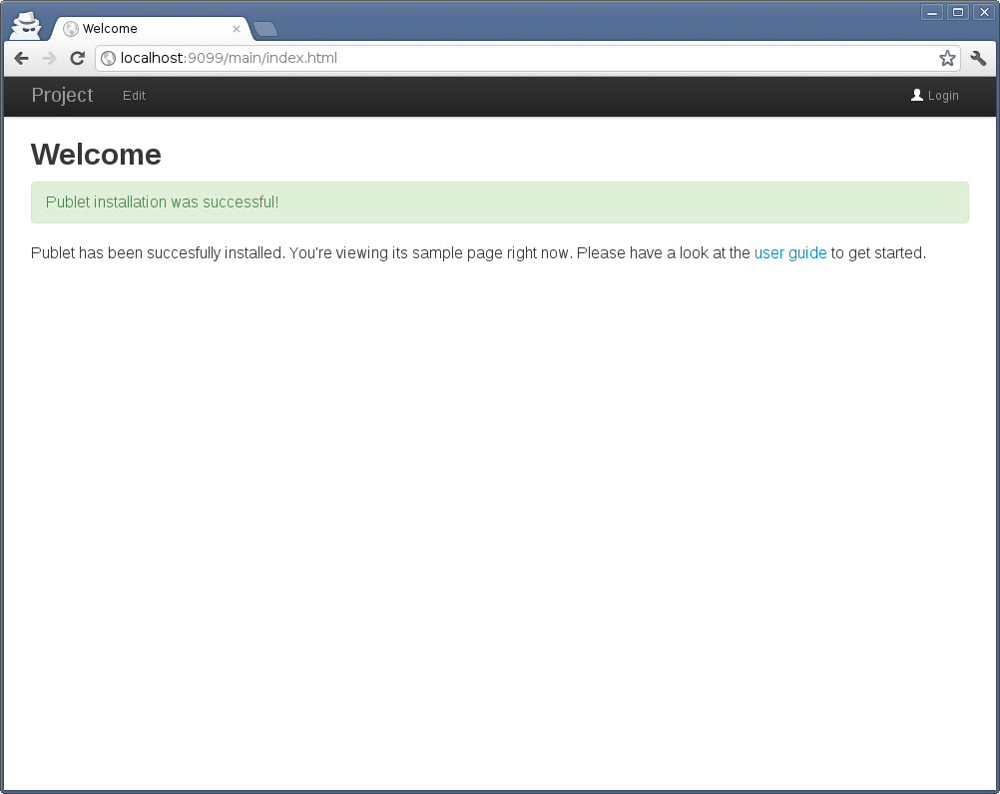
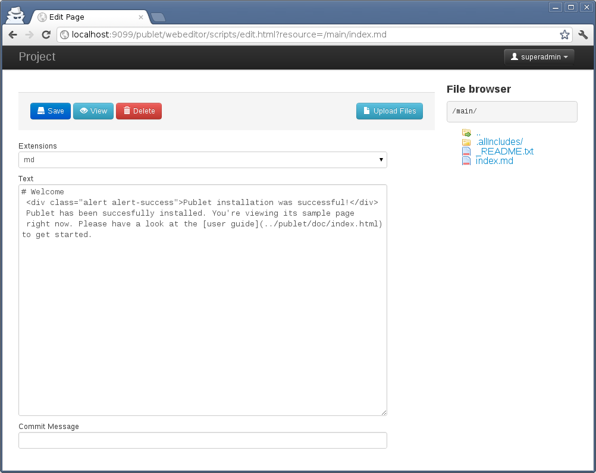
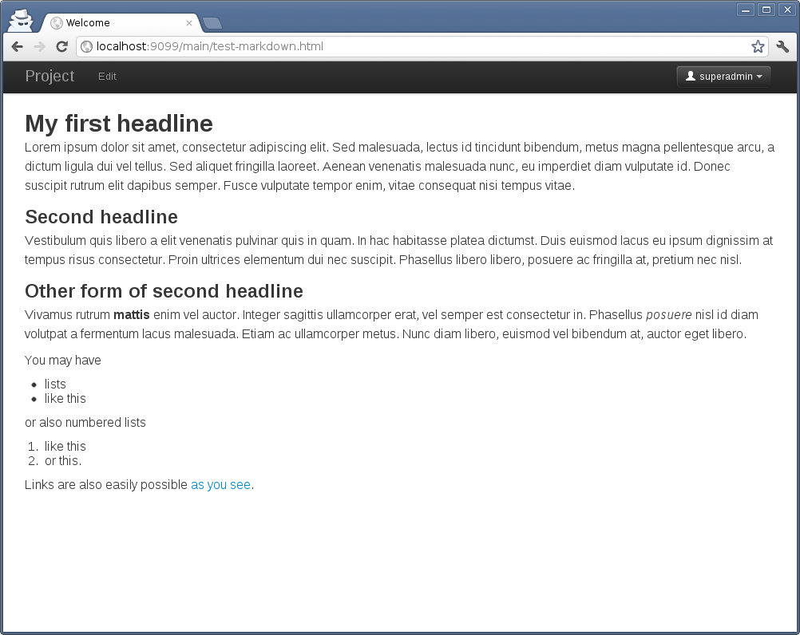

# Usage

When starting publet the first time, it presents a welcome screen similiar to this:

Publet initializes the content root repository with this example content.

You can click on the _Edit_ link in the top bar and start editing the
`index.md` file. This will show the login page, because you need write
privileges. On first start you can use "superadmin" as username and password
to to login as a super user.

Then the edit screen is presented with the initial contents of the `index.md`
file:

Let me explain what you see there. At the right hand side, there is a file
browser component that shows the files on the server. If you click on one, the
edit screen updates with the corresponding file. You can go up and down
directories as usual.

On the top there is a button bar with some actions: saving changes, deleting
the file in questions, or to cancel the action and view the page. The button
_Upload Files_ takes you to another screen for uploading files (instead of
editing).

Below the button bar, there is a combo box _Extensions_. This lets you choose
from a set of file extensions. The file you're editing is then saved using
this extension. This is quite important as the file extension is used to
determine the processing strategy. Files with `md` extension are known
markdown files and processed accordingly to get the HTML output.

At the bottom you can add an optional commit message that is saved along with
the change.

## Markup

As said in the introduction, publet utilises
[Scalate](http://scalate.fusesource.org/) for template and wiki file
processing. Therefore you are advised to visit [their
documentation](http://scalate.fusesource.org/documentation/index.html) on the
different supported template languages and their syntax. Here I will give
a short summary of their documentation to get some feel about it.

### Wiki: Markdown

One of the popular wiki syntaxes is _Markdown_. It is very easy to write and
is designed to be readable as is, as plain text. The complete markdown syntax
is [explained here](http://daringfireball.net/projects/markdown/).

#### Example

Here is a silly example:

    # My first headline

    Lorem ipsum dolor sit amet, consectetur adipiscing elit. Sed malesuada,
    lectus id tincidunt bibendum, metus magna pellentesque arcu, a dictum
    ligula dui vel tellus. Sed aliquet fringilla laoreet. Aenean venenatis
    malesuada nunc, eu imperdiet diam vulputate id. Donec suscipit rutrum elit
    dapibus semper. Fusce vulputate tempor enim, vitae consequat nisi tempus
    vitae.

    ## Second headline

    Vestibulum quis libero a elit venenatis pulvinar quis in quam. In hac
    habitasse platea dictumst. Duis euismod lacus eu ipsum dignissim at tempus
    risus consectetur. Proin ultrices elementum dui nec suscipit. Phasellus
    libero libero, posuere ac fringilla at, pretium nec nisl.

    Other form of second headline
    -----------------------------

    Vivamus rutrum __mattis__ enim vel auctor. Integer sagittis ullamcorper erat,
    vel semper est consectetur in. Phasellus _posuere_ nisl id diam volutpat a
    fermentum lacus malesuada. Etiam ac ullamcorper metus. Nunc diam libero,
    euismod vel bibendum at, auctor eget libero.

    You may have

    * lists
    * like this

    or also numbered lists

    1. like this
    1. or this.

    Links are also easily possible [as you see](http://google.com).

You need to use the file extension `md` or `markdown`. The resulting HTML is shown in the image below.

### Wiki: Textile

_Textile_ is another very popular wiki syntax. It allows more HTML tweakings than markdown. The complete
syntax is available on the [textile page](http://textile.thresholdstate.com/).

#### Example

    h1. My first headline

    Lorem ipsum dolor sit amet, consectetur adipiscing elit. Sed malesuada, lectus id tincidunt bibendum, metus magna pellentesque arcu, a dictum ligula dui vel tellus. Sed aliquet fringilla laoreet. Aenean venenatis malesuada nunc, eu imperdiet diam vulputate id. Donec suscipit rutrum elit dapibus semper. Fusce vulputate tempor enim, vitae consequat nisi tempus vitae.

    h2. Second headline

    Vestibulum quis libero a elit venenatis pulvinar quis in quam. In hac habitasse platea dictumst. Duis euismod lacus eu ipsum dignissim at tempus risus consectetur. Proin ultrices elementum dui nec suscipit. Phasellus libero libero, posuere ac fringilla at, pretium nec nisl.

    h2. Other form of second headline

    Vivamus rutrum *mattis* enim vel auctor. Integer sagittis ullamcorper erat, vel semper est consectetur in. Phasellus _posuere_ nisl id diam volutpat a fermentum lacus malesuada. Etiam ac ullamcorper metus. Nunc diam libero, euismod vel bibendum at, auctor eget libero.

    You may have

    * lists
    * like this

    or also numbered lists

    # like this
    # or this.

    Links are also easily possible "as you see":http://google.com.

This produces the same output as the markdown example.

### Jade

Jade is a template language for producing HTML code. It simplifies HTML
writing tremendously. Visit the [Scalate
Documentation](http://scalate.fusesource.org/documentation/jade.html)
for more information.

Here is an example that demostrates the combination of markdown and jade. This
example is taken from Scalate's documentation page:

> Here's an example of some text markup with hyperlinks using vanilla jade
>
>       .foo
>         p
>           | This is some
>           b text
>           | with a
>           a(href="http://fusesource.com") FuseSource
>           | link.
>
> Now lets use markdown - which is great for concise DRY text with markup effects and embedded links..
>
>     .foo
>       :markdown
>         This is some **text** with a [FuseSource](http://fusesource.com) link.
>
> Both of which should generate something like this
>
>     

>       

>         This is some <b>text</b> with a <a href="http://fusesource.com">FuseSource</a> link.
>       

>     

### SSP

SSP templates are similiar to JSP or Velocity templates, but Scala is used
as language for expressions and code. The
[SSP documentation](http://scalate.fusesource.org/documentation/ssp-reference.html)
at Scalate shows the complete syntax.

SSP is mixing normal HTML with Scala code that is enclosed in `<% %>` tags.
Sometimes this is helpful if some dynamic content must be added to a normal
HTML page. In this case, simply rename the file from _html_ to _ssp_ and add
code.

### Page

Files with extension `page` allow to define multiple sections with content
made up of any of the supported template languages. The contents of each
section is then bound to a variable which is handed to the layout template.

Apparently I couldn't find any documenation at Scalate's site, so I'm writing
here what I figured out.

Consider the following `page` file:

    ---
    title: My page title

    --- name:content pipeline:jade
    h1 headline

    .row
      .span10.offset1
        :markdown
          This is a markdown paragraph

Sections are divided by three dashes `---`. The first sections defines the
value of the parameter `title`. This parameter is handed to the layout
template. If publet's default layout is used, it will use this value to render
the page title.

Then the second section is introduced by the next three dashes. It specifies
the variable name `content` and a pipeline of `jade`. That means that the
following content is a jade template and this should be bound to the variable
`content`. The `content` variable is then used as the page body in the layout
template.

With this concept, a `page` file can contribute to the html head section as
well. Only define a section of name `head` and add javascript, css or whatever
else:

    ---
    title: My page title

    --- name:head pipeline:jade
    :javascript
      $(function() {
        alert("I say hi!");
      });

    --- name:content pipeline:jade
    h1 headline

    .row
      .span10.offset1
        :markdown
          This is a markdown paragraph

This works, because the default layout defines a parameter of name `head`. This
is a very powerful concept that allows for flexible layout and page creation.

The pipeline can name any supported template or wiki language. The default is
_markdown_ if it is omitted.

## Includes

Using the `include()` function in templates, you can include other templates on the server
side. With Jade, it looks like this:

    =include("_description.md")

It's also possible to include content via ajax at the client. A small javascript
function is executed on each page that looks for tags with a `p:ref` attribute. If found,
it triggers an ajax request to the URL obtained from the `p:ref` attribute and adds
the returned html inside that element (The parameter `noLayout` is added automatically
to the request). Using Jade again, the client side include could look like this:

    div(p:ref="_description.html")

Note, that you now need to specify the `html` file if you want to include the
HTML output of the markdown file `_description.md`.