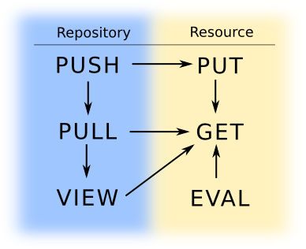

# Security

## Aufbau


          Browser            Git Client

    ------------------------------------------
      +-----------------+  +---------------+
      | Publet Servlet  |  | Git Servlet   |
      |                 |  |               |
      |  Engines (a=x ) |  |               |
      +-----------------+  +---------------+
    ------------------------------------------
     +-----------+ +---------+ +-------+
     | read-only | | content | | repo1 | ...
     | Repo      | |  root   | |       |
     +-----------+ +---------+ +-------+

Jedes Request geht irgendwann auf eine Resource in einem Repository. Es kann
sein, dass es sich um eine `read-only` Quelle, wie z.B. Classpath-Resourcen
handelt.

## Permissions

Es gibt zunächst Permissions auf Repository Ebene:

* `PUSH`: Das Schreibrecht auf ein Repository. Es impliziert alle Leserechte
  auf dieses Repository
* `PULL`: Das Leserecht auf ein Repository. Es impliziert `VIEW`
* `VIEW`: Der git-client ist komplett verboten. Es ist kein clone/pull möglich
  (natürlich auch kein push). Es befähigt nur dazu die Resources über das Publet
  Servlet anzusprechen. Dann kommen evtl. weitere Permissions ins Spiel.

  Auf Repository-Ebene ist der Zugriff für nicht-authentifizierte Benutzer im
  Prinzip verweigert, allerdings hat der Server die Möglichkeit evtl. dennoch
  den Zugriff zu gewähren.

Diese Rechte beziehen sich immer gleich auf ein ganzes Repository. Die Permission
`VIEW` bedeutet, dass es evtl. möglich ist, auf die Resourcen über das Web-Interface
zuzugreifen. Hier können abhängig von dem Pfad zu der Resource im Repository weitere Rechte
definiert werden. Ein Teil des Pfades der Request-Url wird irgendwann in ein
Repository reichen.

Ein Repository kann immer entweder `public`, `private` oder `published` sein. Im ersten
Fall, gibt es worl-wide Leserechte. D.h. jedes Request hat implizit das `PULL` Recht. Damit
kann jeder das Repository clonen und im Web anschauen. Da ausserdem auch `GET` implizit
vorhanden ist, sind die Resourcen auch per Web-Interface sichtbar.

Ist ein Repository als `published` markiert, gibt es world-wide `GET` Rechte und durch das
implizierte `VIEW` ist das Git Repo nicht für clients verfügbar. Es kann also jeder über
das Web-Interface die Resourcen sehen, aber nur authentifizierte (und authorisierte) Nutzer
können mit dem git client das Repository auschecken und/oder schreiben. Der Zugriff kann
mittels der Resource-Permissions nun weiter auf Pfad-Ebene eingeschränkt werden.

`private` Repositories sind generell nur für authentifizierte und authorisierte Nutzer
zugänglich, egal über welchen Client. Private Repositories verlangen immer eine
Authentifizierung. Egal, ob über Web oder git client zugegriffen wird. Danach geht's
nur weiter, wenn des Request die erforderliche Permission hat.


### Website

Websites sind Repositories, die ausserdem über das Web Interface bearbeitet und eingesehen
werden können.

Es können pro URL im Repository Rechte definiert werden, welche beim Zugriff geprüft
werden. Vorraussetzung ist, dass mindestens das Recht `VIEW` existiert.

Hier gibt es die Unterscheidung zwischen drei verschiedenen Aktionen:

* `GET`: das Lesen der Resource evtl. mit voriger Konvertierung in das gewünschte Format
* `PUT`: Schreiben der Resource über das Web-Interface
* `EVAL`: Ausführen von Skripten

Durch die Repository Rechte können `GET` und `PUT` oft impliziert werden:

* `PULL` -> `GET` für alle Resourcen im Repo
* `PUSH` -> `PUT` für alle Resourcen im Repo

Das `EVAL` Recht ist unabhängig davon und bedeutet das Recht, Skripte auf dem Server
auszuführen. Das kann unabhängig von Schreibrechten definiert werden, impliziert aber
immer ein Leserecht `GET`.

Diese Rechte gelten nur für Zugriffe über das Publet Servlet. Damit ergibt sich
folgendes Bild



Mit dem Repository Recht `VIEW` erlangt man die Möglichkeit, dass auf Resource Ebene
weitere Rechte geprüft werden. Mit der Permission `NONE` wird das von vornherein
verhindert.


#### Engines

Für die Umwandlung von den Resourcen in das Ziel-Format gibt es eine Reihe von _Engines_.
Man kann eine explizit auswählen mit dem `a=...` Request Parameter. Für die Permissions
gibt es nur den Unterschied zwischen `eval|evalinclude` und den anderen. Wenn die Engine
`eval` oder `evalinclude` aktiv ist wird nochmals auf das `EVAL` Permission geprüft. Es
sei denn, es ist die Default-Engine der Resource. In dem Fall ist es wieder ein `GET`.


### Projects

Ein Projekt ist das Tupel `(Repository, Website, Issue-Mgmt, Maven/Ivy Repo)`. Es beinhaltet
also 4 Git Repositories, jeweils eines für:

* den Quellcode des Projektes
* die Website
* die Datenbank des Issue Managements
* das Maven/Ivy Repository

Hier können die vier Permissions auf jedes Repository einzeln vergeben werden, oder auf das
ganze Projekt.


## Definieren der Permissions

Eine Permission setzt sich immer wie folgt zusammen:

    perm       := perm_id ":" object_id
    perm_id    := "PUSH" | "PULL" | "VIEW" |
                  "PUT" | "GET" | "EVAL"
    object_id  := path
    path       := ident { ":" ident }
    ident      := "a-zA-Z0-9_-."

Es sind die aufgezählten Permissions möglich, dann kommt die Beschreibung
von dem was geschützt sein soll. Das kann der Name eines Repositories sein
(der Pfad) oder der Pfad-Teil einer Resource ab dem Repository.

Beispiele:

    PUSH:jdoe/utils.git
    PULL:contentroot
    VIEW:contentroot
    GET:contentroot:projects:*
    EVAL:wikis/projects:samples:scala:*


# Zuweisen von Permissions

## Repository Markierung

Als erstes muss das Repository eine der drei Markierungen bekommen. Ist
nichts definiert, gilt der Wert `published`.

    wikis/mywiki = published
    contentroot = private
    projects/scalautils = public

## Repository Permissions

Benutzer können Gruppen zugewiesen werden und Gruppen erhalten dann eine
Anzahl von Permissions. Permissions können nicht einzelnen Benutzern
zugewiesen werden.

Gruppen:

    contentroot_all := PUSH:contentroot
    mywikigroup := GET:wikis/mywiki:*


## Resource Permissions

Es kann definiert werden, welche Permissions vorhanden sein müssen, um auf gewisse
Resourcen innerhalb eines Repos zuzugreifen. Das funktioniert nur für das Publet
Web interface und macht daher keinen Sinn, wenn sowieso schon `PULL` Rechte bestehen.


    wikis/mywiki:dev/jetty.html = readdev, editor

Die obere Zeile resultiert in dem Check von `readdev:wikis/mywiki:dev/jetty.html`
und `editor:wikis/mywiki:dev/jetty.html` wenn auf die Resource `dev/jetty.html`
zugegriffen wird. Der User muss also beide Permissions haben.


# Impl

Request an Publet Servlet. Repository ist `published` mit weiteren Einschränkungen:

1. Request = `/wikis/mywiki/dev/jetty.html`
1. Repository identifizieren => `wikis/mywiki`
2. Markierung holen => `published`
3. Es gilt implizit die Permission `VIEW`. D.h. es existiert automatisch bereits  `GET` falls
   nicht weiter eingeschränkt.
4. Hole Permissions zum Pfad `dev/jetty.html` des Repos `wikis/mywiki` => `readdev` und `editor`
5. check `readdev:wikis/mywiki:dev/jetty.html`
6. check `editor:wikis/mywiki:dev/jetty.html`
7. ok, serve


Request an Publet Servlet. Repository ist `private`

1. Request = `/wikis/mywiki/index.html`
1. Repository identifizieren => `wikis/mywiki`
2. Markierung holen => `private`
3. check `GET:wikis/mywiki:index.html`
4. ok, server

Request an Publet Servlet. Repository ist `public`

1. Request = `/wikis/mywiki/index.html`
1. Repository identifizieren => `wikis/mywiki`
2. Markierung holen => `public`
3. gilt implizit `PULL`, damit auch `GET`. Da sowieso Lesezugriff auf das
   gesamte Repository besteht, wird nicht nochmal auf spezielle Resource
   Permissions geprüft.
7. ok, serve


Clone-Request an Git Servlet, `public`:

1. Repository = `wikis/mywiki`
2. Markierung holen => `public`
3. `PULL` Rechte bestehen implizit, weiter ohne Authentifizierung
4. ok, server

Clone-Request an Git Servlet, `private`:

1. Repository = `wikis/mywiki`
2. Markierung holen => `private`
3. check `PULL:wikis/mywiki`
4. ok, server


## Konfiguration

Es werden 4 Konfigurationsdateien definiert:

1. `repositories.cfg` für Markierung der einzelnen Repos
2. `users.cfg` als Benutzerdatenbank
3. `permissions.cfg` für Zuweisung der Permissions
4. `resources.cfg` Zugriffsbeschränkung für Resourcen

Oder doch eine grosse XML Datei? Serialisierung ist dann sicher leichter, muss
auch schreiben können.

```scala
<xml>
  <users>
    <user login="jdoe" password="{md5}asdasdas">
      <fullname>John Doe</fullname>
      <email>jdoe@market.com</email>
      <groups>editor,manager,wikiuser</groups>
    </user>
  </users>
  <repositories>
    <repository name="wikis/mywiki" tag="private"/>
    <repository name="contentroot" tag="published"/>
  </repositories>
  <permissions>
    <permission>
      <groups>manager</groups>
      <perms>PULL:contentroot</perms>
    </permission>
    <permission>
      <groups>manager,editor</groups>
      <perms>PULL:wikis/mywiki</perms>
    </permission>
  </permissions>
  <resources>
    <repo name="wikis/mywiki">
      <resource name="index.html" perms="editor, readdev"/>
      <resource name="dev/jetty.html" perms="editor"/>
    </repo>
  </resources>
</xml>
```

Ok, sieht besser aus...